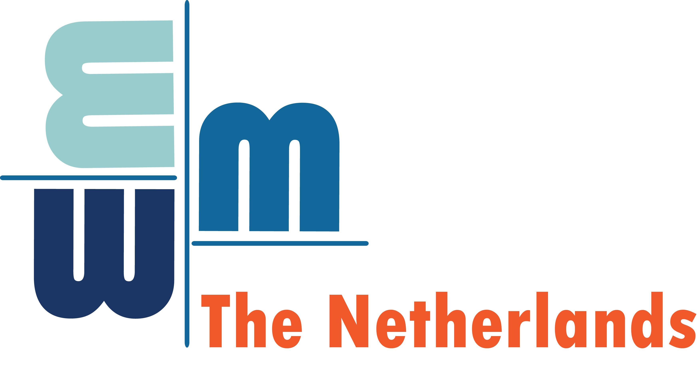

The Netherlands Conference on Computer Vision (NCCV) promotes computer vision research in the Netherlands. NCCV allows researchers to share previous and ongoing work. NCCV has a lunch-to-lunch schedule with an overnight stay to foster interaction between students, researchers, staff, and practitioners both during the scientific program and in the evening. We boast two excellent keynotes, host two lunches, drinks, and snacks, an elaborate dinner, and a social activity during the evening. We have limited space, so be sure to register early.

### Key dates
-----------
* **Registration deadline**: ~~16th of April 2025~~ 
* **Paper submission deadline** ~~18th of April 2025~~
* **Cancellation deadline**: ~~30th of April 2025~~

### Sponsors
----------

        

        

